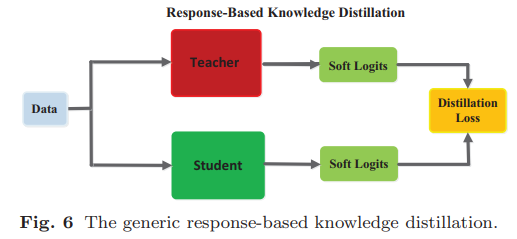
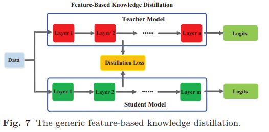

# 模型蒸馏

[Distilling the Knowledge in a Neural Network](arxiv.org/pdf/1503.02531.pdf)

“蝴蝶以毛毛虫的形式吃树叶积攒能量逐渐成长，最后变换成蝴蝶这一终极形态来完成繁殖。”

### 蒸馏温度，软标签

$$Soft Logit: q_i=\frac{exp(z_i/T)}{\Sigma_jexp(z_i/T)} $$

