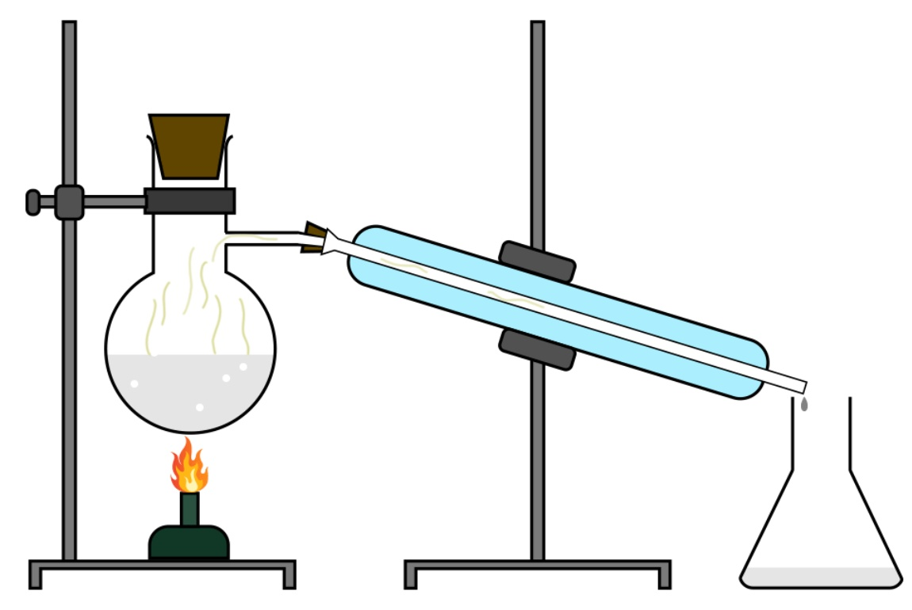
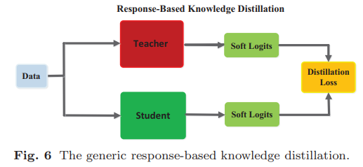
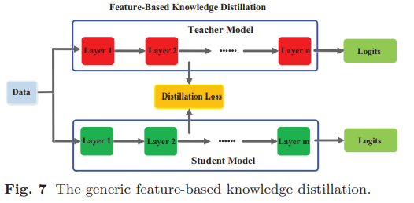

# 模型蒸馏

“蝴蝶以毛毛虫的形式吃树叶积攒能量逐渐成长，最后变换成蝴蝶这一终极形态来完成繁殖。”

## 蒸馏方法

### 1. response-based

[Distilling the Knowledge in a Neural Network](arxiv.org/pdf/1503.02531.pdf)

Teacher：  对$softmax(T=20 )$的输出与原始label求loss。

Student： （1）对$softmax(T=20 )$的输出与Teacher的$softmax(T=20)$的输出求$loss_1$。

　　　　　（2）对$softmax(T=1)$的输出与原始label求$loss_2$。

　　　　　（3）$loss = loss_1+loss_2$

### 2. feature-based

[FITNETS: HINTS FOR THIN DEEP NETS](https://arxiv.org/pdf/1412.6550.pdf?source=post_page---------------------------)

1. 训练teacher network, finet随机初始化
2. hints training: 选取teacher的中间层作为guidance，对student的中间层进行监督学习，通常两者的维度不一样，所以需要一个额外的**线性矩阵**或**卷积层**去进行维度变换，达到维度一致，然后使用L2 Loss进行监督学习(训练的是到guided layer为止的参数$W_{guided}$)$$L_{HT}(W_{Guided},W_r)=\frac{1}{2}||u_h(\textbf{x};\textbf{W}_{hint})-r(v_g(\textbf{x};\textbf{W}_{Guided});\textbf{W}_r)||^2$$
3. 利用knowledge distillation去训练student的整个网络参数

## 蒸馏温度，软标签

$$Soft Logit: q_i=\frac{exp(z_i/T)}{\Sigma_jexp(z_i/T)} $$

- T 是超参: Temperature
- $T = 1$时，就是平常使用的 $softmax$
- T 越大 ， 类别之间的概率分布越 softer（减小不同类别归属概率的两极分化程度）
  - $T = 1 , [ 3 , 10 ] → [ 0.0009 , 0.9991 ] $
  - $T=10, [3,10] \rightarrow [0.33,0.67]$
  - $ T=100,[3,10]→[0.48,0.52]$

## 实验结果

https://github.com/airaria/TextBrewer

| Model                         | XNLI | LCQMC | CMRC 2018   | DRCD        |
| ----------------------------- | ---- | ----- | ----------- | ----------- |
| **RoBERTa-wwm-ext** (teacher) | 79.9 | 89.4  | 68.8 / 86.4 | 86.5 / 92.5 |
| T3                            | 78.4 | 89.0  | 66.4 / 84.2 | 78.2 / 86.4 |
| T3-small                      | 76.0 | 88.1  | 58.0 / 79.3 | 75.8 / 84.8 |
| T4-tiny                       | 76.2 | 88.4  | 61.8 / 81.8 | 77.3 / 86.1 |

| Model                       | XNLI | LCQMC | CMRC 2018   | DRCD        | MSRA NER |
| --------------------------- | ---- | ----- | ----------- | ----------- | -------- |
| **Electra-base** (teacher)) | 77.8 | 89.8  | 65.6 / 84.7 | 86.9 / 92.3 | 95.14    |
| Electra-small               | 77.7 | 89.3  | 66.5 / 84.9 | 85.5 / 91.3 | 93.48    |

使用哈工大蒸馏框架textbrewer对指标词抽取模型实验，electra_small蒸馏模型准确率不如直接训练。

| 指标词抽取实验          | precison | recall | f1-score |
| ----------------------- | -------- | ------ | -------- |
| electra_base(Teacher)   | 0.77     | 0.79   | 0.78     |
| electra_small(Student)  | 0.71     | 0.71   | 0.71     |
| electra_small(直接训练) | 0.72     | 0.77   | 0.74     |